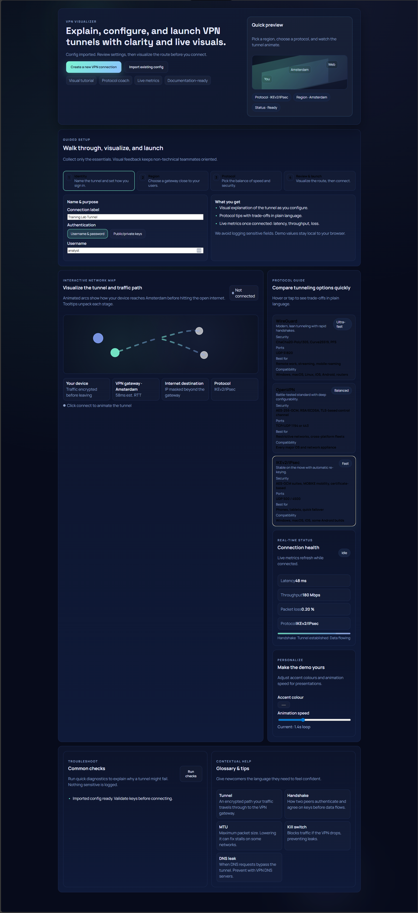

# VPN Visualizer

An interactive React + Vite experience for explaining, configuring, and monitoring VPN tunnels. It mirrors a guided wizard: select a region, compare protocols, launch the connection, and see the tunnel animate with live metrics.



## Quick start (Docker-only)

Run everything in containers to keep the host clean:

```bash
# dev server with hot reload on http://localhost:5173
docker-compose up app
```

The compose setup mounts the repo but keeps `node_modules` inside a named volume so nothing is installed on the host.

## Production image

Build and serve the static site with Nginx:

```bash
docker build -t vpn-visualizer .
docker run -p 8080:80 vpn-visualizer
# open http://localhost:8080
```

## What’s inside

- React + TypeScript + Vite UI scaffold
- Interactive network map showing device → gateway → internet hops
- Guided wizard (identity, region, protocol, review/connect)
- Protocol selector with plain-language trade-offs
- Live metric simulation (latency/throughput/loss) once “connected”
- Personalization controls (accent color, animation speed)
- Troubleshooting checklist and glossary for newcomers
- AWS-aware options: Client VPN, Site-to-Site, and sidecar targets with VPC/subnet/SG/CIDR callouts
- Config preview/export: copy-ready snippets for AWS Client VPN, Site-to-Site runbooks, sidecars, or WireGuard
- Local persistence (settings, AWS fields, theme) stored in the browser for demos

## Project structure

- `src/App.tsx` – main experience, wizard flow, map, metrics, personalization
- `src/App.css`, `src/index.css` – theme, layout, and map animations
- `Dockerfile` – multi-stage build to static assets served by Nginx
- `docker-compose.yml` – dev server container with hot reload
- `docs/design.md` – UX/architecture notes
- `docs/goals.md` – project intent
- `ROADMAP.md` – phased plan with checklists

## Next steps

1) Add a backend adapter for OpenVPN/WireGuard APIs to replace simulated metrics.  
2) Feed real region lists from providers and persist user presets.  
3) Expand troubleshooting to run real connectivity checks (MTU, DNS leaks).  
4) Add documentation generation (MDX/Docs site) describing flows and APIs.  
5) Integrate AWS metadata (Client VPN, Site-to-Site/TGW) and export configs.  
6) Swap simulated telemetry for real CloudWatch/agent feeds and support downloads of generated configs.  
